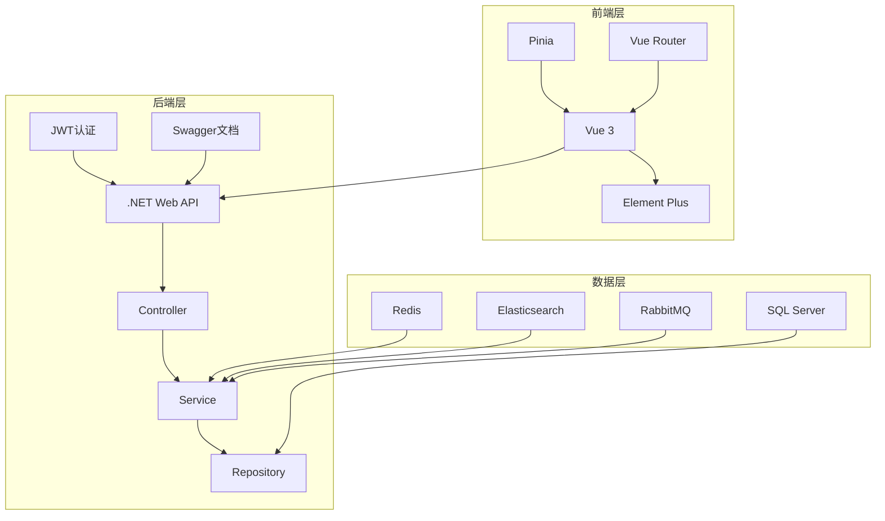
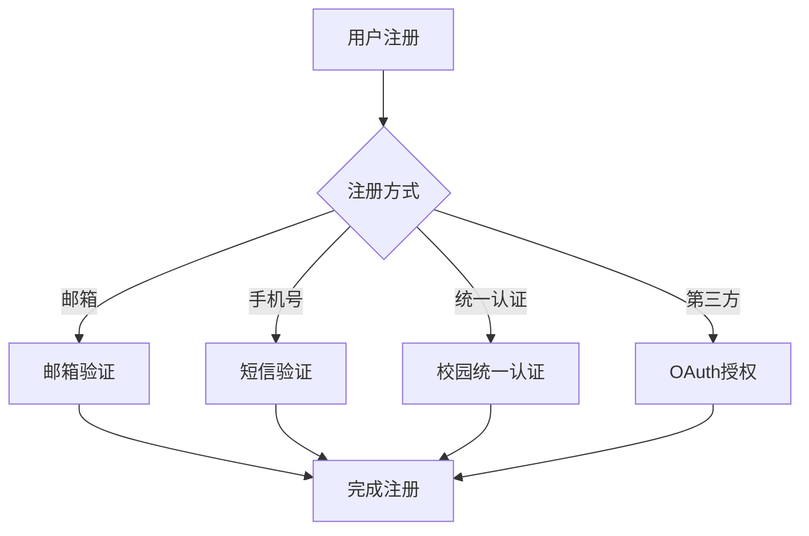
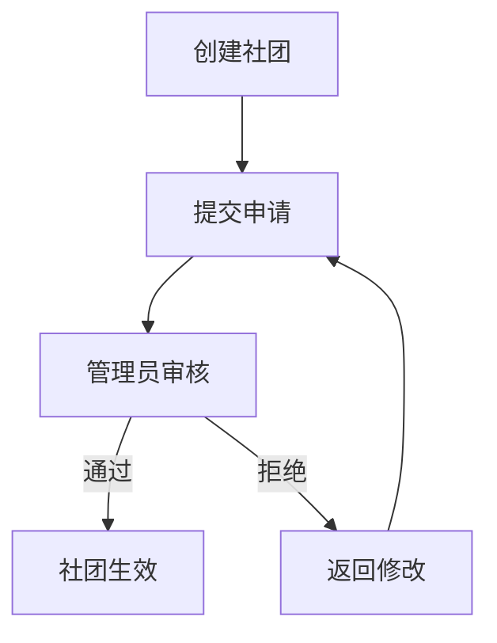
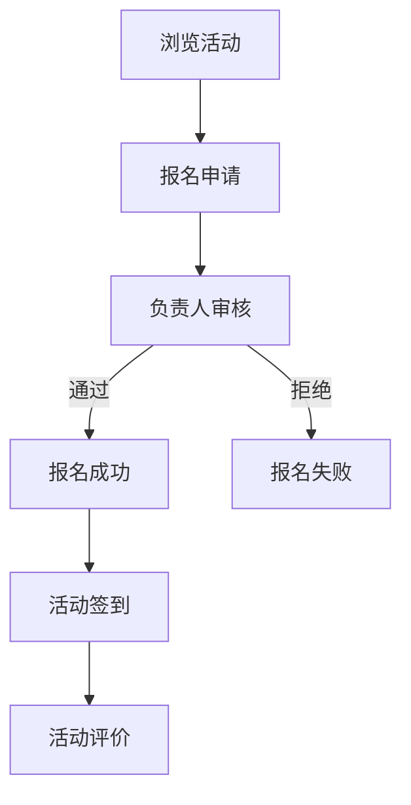
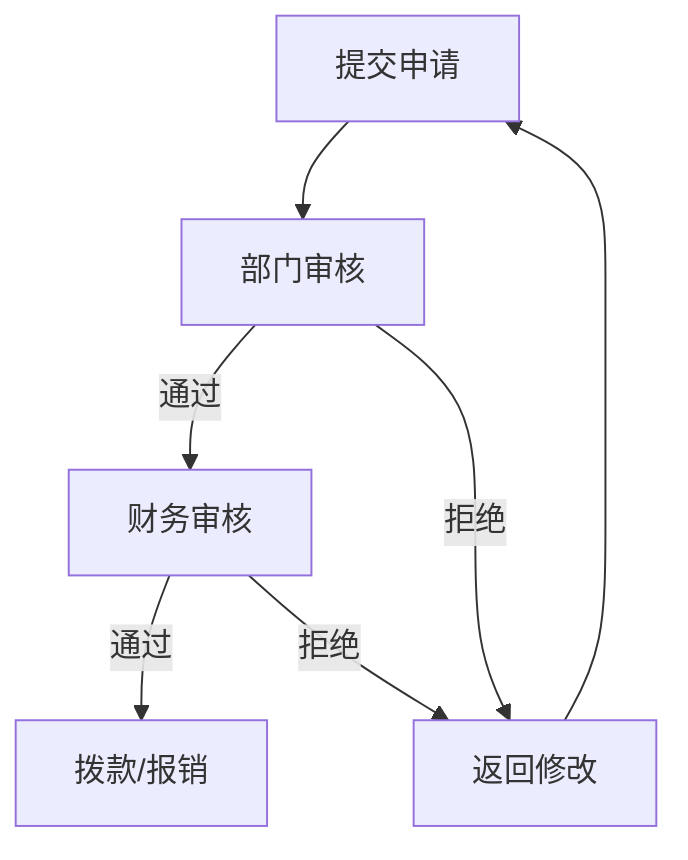
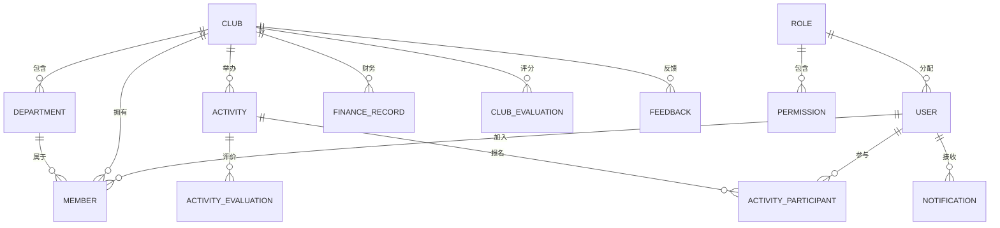

# 高校社团管理系统 - 完整项目总结

> 包含所有对话记录、需求讨论和生成文件的完整总结

---

## 目录

1. [项目背景与目标](#1-项目背景与目标)
2. [核心需求分析](#2-核心需求分析)
3. [技术架构设计](#3-技术架构设计)
4. [用户角色体系](#4-用户角色体系)
5. [功能模块清单](#5-功能模块清单)
6. [业务流程设计](#6-业务流程设计)
7. [数据库设计](#7-数据库设计)
8. [API接口设计](#8-api接口设计)
9. [已生成的文件](#9-已生成的文件)
10. [开发进度与待办事项](#10-开发进度与待办事项)
11. [启动与部署](#11-启动与部署)

---

## 1. 项目背景与目标

### 1.1 项目背景
高校社团管理系统是一个基于Vue 3 + .NET Web API + SQL Server的现代化社团管理平台，旨在提升高校社团管理效率，实现社团活动的信息化管理。

### 1.2 项目目标
- 提供便捷的社团管理功能
- 支持活动的发布、报名和扫码签到
- 实现财务管理和审批流程
- 提供数据统计和分析功能
- 支持移动端访问

---

## 2. 核心需求分析

### 2.1 需求来源（对话记录摘要）

**用户需求要点：**

| 需求类别 | 具体需求 | 讨论时间 |
|----------|----------|----------|
| 用户管理 | 多种注册方式（邮箱、手机号、统一认证、OAuth） | 多次讨论 |
| 用户管理 | 权限管理、批量操作 | 架构设计阶段 |
| 用户管理 | 登录失败锁定、Token刷新机制 | 安全设计阶段 |
| 社团管理 | 创建、审核、注销、部门管理 | 多次讨论 |
| 社团管理 | 主席/副主席数量限制（最多2人） | 架构设计阶段 |
| 成员管理 | 加入申请、审批、角色分配、导出 | 功能讨论 |
| 活动管理 | 创建、审核、报名、扫码签到、总结 | 多次讨论 |
| 活动管理 | 活动评价系统 | 功能讨论 |
| 财务管理 | 经费申请、审批、报表、预算 | 功能讨论 |
| 通知公告 | 系统通知、社团通知、活动通知 | 功能讨论 |
| 文件上传 | 图片上传、文档管理 | 功能讨论 |
| 数据统计 | 数据看板、趋势分析 | 功能讨论 |
| 评价系统 | 活动评价、社团评分、意见反馈 | 功能讨论 |
| 移动端 | 底部导航、响应式、拍照上传 | 架构设计阶段 |
| 安全审计 | 操作审计日志、API限流 | 安全设计阶段 |

**用户特别要求：**
- 首页按照用户分类有不同的内容
- 扫码签到功能
- 数据导出功能
- 移动端适配

---

## 3. 技术架构设计

### 3.1 架构设计



### 3.2 技术选型

| 分类 | 技术 | 版本 | 说明 |
|------|------|------|------|
| 前端框架 | Vue | 3.x | 渐进式JavaScript框架 |
| UI组件 | Element Plus | - | 企业级UI组件库 |
| 状态管理 | Pinia | - | 状态管理库 |
| 路由管理 | Vue Router | 4.x | 路由管理器 |
| HTTP客户端 | Axios | - | HTTP请求库 |
| 构建工具 | Vite | - | 构建工具 |
| 后端框架 | .NET Web API | 9.0/10.0 | 跨平台后端框架 |
| ORM | Entity Framework Core | - | 对象关系映射 |
| 数据库 | SQL Server | 2022 | 关系型数据库 |
| 缓存 | Redis | 7.x | 内存数据库 |
| 全文搜索 | Elasticsearch | 8.x | 全文搜索引擎 |
| 消息队列 | RabbitMQ | 3.x | 消息中间件 |
| 认证 | JWT | - | JSON Web Token |

### 3.3 关键设计

**认证设计：**
- 使用JWT进行身份认证
- Token有效期：2小时
- 支持Token刷新机制
- 支持多设备登录管理
- 登录失败锁定（5次失败锁定15分钟）

**权限设计：**
- 基于角色的访问控制（RBAC）
- 支持细粒度权限控制
- 支持权限继承
- 支持角色自定义

**缓存策略：**
- 热点数据缓存（社团列表、活动列表）
- 用户权限缓存
- 配置缓存
- 缓存过期策略

---

## 4. 用户角色体系

### 4.1 角色定义

| 角色 | 描述 | 数量限制 | 权限范围 |
|------|------|----------|----------|
| 超级管理员 | 系统最高权限，管理所有功能 | - | 所有权限 |
| 普通管理员 | 负责社团审核、活动审批等 | - | 用户管理、审核权限 |
| 社团主席 | 管理社团日常事务 | 最多2人/社团 | 社团管理、活动管理 |
| 副主席 | 协助主席管理（可选） | 0-2人/社团 | 主席权限子集 |
| 部门主席 | 管理特定部门 | 最多2人/部门 | 部门管理权限 |
| 部长 | 部门次级管理 | 最多8人/部门 | 部门管理权限 |
| 部员 | 普通成员 | - | 基础权限（查看、报名） |
| 访客 | 未登录用户 | - | 浏览权限 |

### 4.2 权限矩阵

| 功能 | 超级管理员 | 普通管理员 | 社团主席 | 部门主席 | 部员 | 访客 |
|------|-----------|-----------|---------|---------|------|------|
| 用户管理 | ✅ | ✅ | ❌ | ❌ | ❌ | ❌ |
| 社团审核 | ✅ | ✅ | ❌ | ❌ | ❌ | ❌ |
| 社团创建 | ✅ | ✅ | ✅ | ❌ | ❌ | ❌ |
| 社团管理 | ✅ | ✅ | ✅ | ❌ | ❌ | ❌ |
| 活动创建 | ✅ | ✅ | ✅ | ✅ | ❌ | ❌ |
| 活动审核 | ✅ | ✅ | ✅ | ❌ | ❌ | ❌ |
| 报名活动 | ✅ | ✅ | ✅ | ✅ | ✅ | ❌ |
| 扫码签到 | ✅ | ✅ | ✅ | ✅ | ❌ | ❌ |
| 财务管理 | ✅ | ✅ | ✅ | ❌ | ❌ | ❌ |
| 评价活动 | ✅ | ✅ | ✅ | ✅ | ✅ | ❌ |
| 查看社团 | ✅ | ✅ | ✅ | ✅ | ✅ | ✅ |

---

## 5. 功能模块清单

### 5.1 用户管理模块

| 功能 | 描述 | 状态 |
|------|------|------|
| 用户注册 | 支持邮箱、手机号、统一认证、OAuth | ✅ 已设计 |
| 用户登录 | JWT认证登录 | ✅ 已实现 |
| 个人信息 | 查看和修改个人信息 | ✅ 已实现 |
| 密码修改 | 修改登录密码 | 🚧 待开发 |
| 用户列表 | 管理员查看用户列表 | ✅ 已实现 |
| 权限管理 | 角色分配和权限设置 | 🚧 待开发 |
| 批量操作 | 批量冻结/解冻用户 | 🚧 待开发 |

### 5.2 社团管理模块

| 功能 | 描述 | 状态 |
|------|------|------|
| 社团创建 | 创建新社团申请 | ✅ 已实现 |
| 社团审核 | 管理员审核社团申请 | ✅ 已实现 |
| 社团列表 | 查看所有社团 | ✅ 已实现 |
| 社团详情 | 查看社团详细信息 | 🚧 待开发 |
| 社团修改 | 修改社团信息 | 🚧 待开发 |
| 社团注销 | 注销社团 | 🚧 待开发 |
| 部门管理 | 创建/管理社团部门 | 🚧 待开发 |

### 5.3 成员管理模块

| 功能 | 描述 | 状态 |
|------|------|------|
| 加入申请 | 用户申请加入社团 | ✅ 已实现 |
| 申请审批 | 审批成员加入申请 | ✅ 已实现 |
| 成员列表 | 查看社团成员 | 🚧 待开发 |
| 角色分配 | 分配成员角色 | 🚧 待开发 |
| 成员导出 | 导出成员列表 | 🚧 待开发 |
| 退出社团 | 成员退出社团 | 🚧 待开发 |

### 5.4 活动管理模块

| 功能 | 描述 | 状态 |
|------|------|------|
| 活动创建 | 创建活动申请 | ✅ 已实现 |
| 活动审核 | 管理员审核活动 | ✅ 已实现 |
| 活动列表 | 查看所有活动 | ✅ 已实现 |
| 活动详情 | 查看活动详情 | 🚧 待开发 |
| 活动报名 | 用户报名活动 | ✅ 已实现 |
| 扫码签到 | 活动签到功能 | 🚧 待开发 |
| 活动修改 | 修改活动信息 | 🚧 待开发 |
| 活动总结 | 活动结束总结 | 🚧 待开发 |

### 5.5 财务管理模块

| 功能 | 描述 | 状态 |
|------|------|------|
| 经费申请 | 申请活动经费 | ✅ 已实现 |
| 报销申请 | 费用报销申请 | ✅ 已实现 |
| 财务审核 | 审核财务申请 | 🚧 待开发 |
| 财务记录 | 查看财务记录 | ✅ 已实现 |
| 财务报表 | 生成财务报表 | 🚧 待开发 |
| 预算管理 | 预算设置和管理 | 🚧 待开发 |

### 5.6 评价系统模块

| 功能 | 描述 | 状态 |
|------|------|------|
| 活动评价 | 评价参与的活动 | 🚧 待开发 |
| 社团评价 | 评价加入的社团 | 🚧 待开发 |
| 意见反馈 | 提交意见和建议 | 🚧 待开发 |
| 评价管理 | 管理评价和反馈 | 🚧 待开发 |

### 5.7 通知公告模块

| 功能 | 描述 | 状态 |
|------|------|------|
| 系统通知 | 发送系统级通知 | 🚧 待开发 |
| 社团通知 | 社团内部通知 | 🚧 待开发 |
| 活动通知 | 活动相关通知 | 🚧 待开发 |
| 通知列表 | 查看通知列表 | 🚧 待开发 |
| 标记已读 | 标记通知为已读 | 🚧 待开发 |

### 5.8 数据统计模块

| 功能 | 描述 | 状态 |
|------|------|------|
| 数据看板 | 首页数据展示 | ✅ 已实现 |
| 趋势分析 | 数据分析和趋势 | 🚧 待开发 |
| 数据导出 | 导出数据报表 | 🚧 待开发 |
| 操作日志 | 审计日志查看 | 🚧 待开发 |

---

## 6. 业务流程设计

### 6.1 用户注册流程



### 6.2 社团审核流程



### 6.3 活动报名流程



### 6.4 财务审批流程



---

## 7. 数据库设计

### 7.1 实体关系图



### 7.2 核心数据表

| 表名 | 说明 | 状态 |
|------|------|------|
| Users | 用户表 | ✅ 已创建 |
| Roles | 角色表 | ✅ 已创建 |
| Clubs | 社团表 | ✅ 已创建 |
| Departments | 部门表 | 🚧 待创建 |
| Members | 成员表 | ✅ 已创建 |
| Activities | 活动表 | ✅ 已创建 |
| ActivityParticipants | 活动报名表 | 🚧 待创建 |
| FinanceRecords | 财务记录表 | ✅ 已创建 |
| Notifications | 通知表 | 🚧 待创建 |
| ActivityEvaluations | 活动评价表 | 🚧 待创建 |
| ClubEvaluations | 社团评价表 | 🚧 待创建 |
| Feedbacks | 意见反馈表 | 🚧 待创建 |
| Permissions | 权限表 | 🚧 待创建 |
| RolePermissions | 角色权限表 | 🚧 待创建 |

---

## 8. API接口设计

### 8.1 用户模块

| API路径 | HTTP方法 | 功能描述 | 状态 |
|---------|----------|----------|------|
| `/api/users/register` | POST | 用户注册 | ✅ 已实现 |
| `/api/users/login` | POST | 用户登录 | ✅ 已实现 |
| `/api/users/profile` | GET | 获取个人信息 | ✅ 已实现 |
| `/api/users/profile` | PUT | 更新个人信息 | 🚧 待开发 |
| `/api/users/password` | PUT | 修改密码 | 🚧 待开发 |
| `/api/users` | GET | 获取用户列表 | ✅ 已实现 |
| `/api/users/{id}` | DELETE | 删除用户 | 🚧 待开发 |

### 8.2 社团模块

| API路径 | HTTP方法 | 功能描述 | 状态 |
|---------|----------|----------|------|
| `/api/clubs` | GET | 获取社团列表 | ✅ 已实现 |
| `/api/clubs` | POST | 创建社团 | ✅ 已实现 |
| `/api/clubs/{id}` | GET | 获取社团详情 | ✅ 已实现 |
| `/api/clubs/{id}` | PUT | 更新社团信息 | 🚧 待开发 |
| `/api/clubs/{id}` | DELETE | 删除社团 | 🚧 待开发 |
| `/api/clubs/{id}/audit` | POST | 审核社团 | ✅ 已实现 |
| `/api/clubs/{id}/join` | POST | 加入社团 | ✅ 已实现 |
| `/api/clubs/{id}/leave` | POST | 退出社团 | 🚧 待开发 |

### 8.3 活动模块

| API路径 | HTTP方法 | 功能描述 | 状态 |
|---------|----------|----------|------|
| `/api/activities` | GET | 获取活动列表 | ✅ 已实现 |
| `/api/activities` | POST | 创建活动 | ✅ 已实现 |
| `/api/activities/{id}` | GET | 获取活动详情 | 🚧 待开发 |
| `/api/activities/{id}` | PUT | 更新活动信息 | 🚧 待开发 |
| `/api/activities/{id}` | DELETE | 删除活动 | 🚧 待开发 |
| `/api/activities/{id}/audit` | POST | 审核活动 | ✅ 已实现 |
| `/api/activities/{id}/register` | POST | 报名活动 | ✅ 已实现 |
| `/api/activities/{id}/checkin` | POST | 活动签到 | 🚧 待开发 |

### 8.4 成员模块

| API路径 | HTTP方法 | 功能描述 | 状态 |
|---------|----------|----------|------|
| `/api/members` | GET | 获取成员列表 | 🚧 待开发 |
| `/api/members/{id}` | PUT | 更新成员信息 | 🚧 待开发 |
| `/api/members/{id}` | DELETE | 删除成员 | 🚧 待开发 |
| `/api/members/{id}/audit` | POST | 审核成员申请 | 🚧 待开发 |

### 8.5 财务模块

| API路径 | HTTP方法 | 功能描述 | 状态 |
|---------|----------|----------|------|
| `/api/finance` | GET | 获取财务记录 | ✅ 已实现 |
| `/api/finance` | POST | 提交财务申请 | ✅ 已实现 |
| `/api/finance/{id}` | PUT | 更新财务记录 | 🚧 待开发 |
| `/api/finance/{id}/audit` | POST | 审核财务申请 | 🚧 待开发 |
| `/api/finance/statistics` | GET | 获取财务统计 | 🚧 待开发 |

### 8.6 评价模块

| API路径 | HTTP方法 | 功能描述 | 状态 |
|---------|----------|----------|------|
| `/api/evaluations/activity/{activityId}` | POST | 评价活动 | 🚧 待开发 |
| `/api/evaluations/club/{clubId}` | POST | 评价社团 | 🚧 待开发 |
| `/api/evaluations/activity/{activityId}` | GET | 获取活动评价 | 🚧 待开发 |
| `/api/evaluations/club/{clubId}` | GET | 获取社团评价 | 🚧 待开发 |

### 8.7 通知模块

| API路径 | HTTP方法 | 功能描述 | 状态 |
|---------|----------|----------|------|
| `/api/notifications` | GET | 获取通知列表 | 🚧 待开发 |
| `/api/notifications` | POST | 发送通知 | 🚧 待开发 |
| `/api/notifications/{id}/read` | PUT | 标记已读 | 🚧 待开发 |

---

## 9. 已生成的文件

### 9.1 项目目录结构

```
d:\PROJECT\trae\try\CollegeClubSystem\
├── frontend/                    # 前端Vue项目
│   ├── src/
│   │   ├── api/                 # API接口封装
│   │   │   ├── activities.js    # ✅ 活动API
│   │   │   ├── clubs.js         # ✅ 社团API
│   │   │   ├── finance.js       # ✅ 财务API
│   │   │   └── users.js         # ✅ 用户API
│   │   ├── components/          # 公共组件
│   │   │   └── Sidebar.vue      # ✅ 侧边栏组件
│   │   ├── router/              # 路由配置
│   │   │   └── index.js         # ✅ 路由配置
│   │   ├── store/               # 状态管理
│   │   │   └── user.js          # ✅ 用户状态
│   │   ├── utils/               # 工具函数
│   │   │   └── request.js       # ✅ 请求封装
│   │   ├── views/               # 页面组件
│   │   │   ├── ClubList.vue     # ✅ 社团列表
│   │   │   ├── Home.vue         # ✅ 首页
│   │   │   ├── Login.vue        # ✅ 登录页
│   │   │   └── Register.vue     # ✅ 注册页
│   │   ├── App.vue              # ✅ 根组件
│   │   └── main.js              # ✅ 入口文件
│   ├── package.json             # ✅ 依赖配置
│   └── vite.config.js           # ✅ Vite配置
├── backend/                     # 后端.NET项目
│   └── CollegeClubSystem/
│       ├── Controllers/         # API控制器
│       │   ├── ActivitiesController.cs  # ✅ 活动控制器
│       │   ├── ClubsController.cs       # ✅ 社团控制器
│       │   ├── FinanceController.cs     # ✅ 财务控制器
│       │   └── UsersController.cs       # ✅ 用户控制器
│       ├── Data/                # 数据库上下文
│       │   └── AppDbContext.cs  # ✅ 数据库上下文
│       ├── DTOs/                # 数据传输对象
│       │   ├── ClubResponse.cs          # ✅ 社团响应
│       │   ├── CreateActivityRequest.cs # ✅ 创建活动请求
│       │   ├── CreateClubRequest.cs     # ✅ 创建社团请求
│       │   ├── FinanceRequest.cs        # ✅ 财务请求
│       │   ├── LoginRequest.cs          # ✅ 登录请求
│       │   ├── LoginResponse.cs         # ✅ 登录响应
│       │   └── RegisterRequest.cs       # ✅ 注册请求
│       ├── Models/              # 实体模型
│       │   ├── Activity.cs              # ✅ 活动实体
│       │   ├── ActivityParticipant.cs   # ✅ 活动参与者
│       │   ├── Club.cs                  # ✅ 社团实体
│       │   ├── FinanceRecord.cs         # ✅ 财务记录
│       │   ├── Member.cs                # ✅ 成员实体
│       │   ├── Role.cs                  # ✅ 角色实体
│       │   └── User.cs                  # ✅ 用户实体
│       ├── Services/            # 业务逻辑层
│       │   ├── ActivityService.cs       # ✅ 活动服务
│       │   ├── ClubService.cs           # ✅ 社团服务
│       │   ├── FinanceService.cs        # ✅ 财务服务
│       │   ├── IActivityService.cs      # ✅ 活动服务接口
│       │   ├── IClubService.cs          # ✅ 社团服务接口
│       │   ├── IFinanceService.cs       # ✅ 财务服务接口
│       │   ├── IUserService.cs          # ✅ 用户服务接口
│       │   └── UserService.cs           # ✅ 用户服务
│       ├── Program.cs           # ✅ 启动类
│       ├── appsettings.json     # ✅ 应用配置
│       └── appsettings.Development.json # ✅ 开发配置
├── database/                   # 数据库脚本
│   └── init_database.sql       # ✅ 初始化脚本
├── README.md                   # ✅ 项目说明
├── start.bat                   # ✅ 启动脚本
└── 开发进度总结.md             # ✅ 开发进度总结
```

### 9.2 设计文档

| 文档 | 路径 | 说明 |
|------|------|------|
| 技术方案文档 | [高校社团管理系统_技术方案文档.md](file:///d:/PROJECT/trae/try/高校社团管理系统_技术方案文档.md) | 完整技术设计文档 |
| 开发进度总结 | [开发进度总结.md](file:///d:/PROJECT/trae/try/CollegeClubSystem/开发进度总结.md) | 开发进度和待办事项 |
| 项目README | [README.md](file:///d:/PROJECT/trae/try/CollegeClubSystem/README.md) | 项目说明文档 |

---

## 10. 开发进度与待办事项

### 10.1 开发进度统计

| 分类 | 总数 | 已完成 | 待开发 | 完成率 |
|------|------|--------|--------|--------|
| 后端API | 30 | 16 | 14 | 53% |
| 前端页面 | 17 | 4 | 13 | 24% |
| 数据库表 | 13 | 6 | 7 | 46% |

### 10.2 待办事项清单

**第一阶段（核心功能）：**
1. ✅ 搭建后端项目框架
2. ✅ 创建数据库表结构（核心表）
3. ✅ 实现用户认证模块
4. ✅ 实现社团管理模块
5. ✅ 实现活动管理模块（基础）
6. ✅ 实现财务管理模块（基础）
7. 🚧 完善活动管理（活动详情、签到功能）
8. 🚧 完善成员管理模块
9. 🚧 开发社团详情页和活动列表页
10. 🚧 开发"我的社团"和"我的活动"页面

**第二阶段（管理功能）：**
11. 🚧 开发管理员后台页面
12. 🚧 开发负责人管理页面
13. 🚧 完善通知功能

**第三阶段（增强功能）：**
14. 🚧 开发评价系统
15. 🚧 开发数据统计功能
16. 🚧 完善财务报表
17. 🚧 实现移动端优化

---

## 11. 启动与部署

### 11.1 环境要求

**前端：**
- Node.js >= 20.x
- npm >= 10.x

**后端：**
- .NET SDK >= 9.0
- SQL Server 2022 (或SQL Server LocalDB)

### 11.2 启动步骤

**1. 数据库配置**
```sql
-- 在SQL Server Management Studio中执行
-- 运行 database/init_database.sql
```

**2. 后端启动**
```bash
cd CollegeClubSystem/backend/CollegeClubSystem
dotnet restore
dotnet run
# 后端服务: http://localhost:5000
```

**3. 前端启动**
```bash
cd CollegeClubSystem/frontend
npm install
npm run dev
# 前端服务: http://localhost:5173
```

**4. 一键启动**
```bash
# 运行 start.bat
```

### 11.3 测试账号

| 账号 | 密码 | 角色 |
|------|------|------|
| admin | admin123 | 超级管理员 |

---

## 附录：对话历史摘要

### 需求讨论要点

1. **用户角色**：8种角色体系，主席数量限制
2. **注册方式**：支持邮箱、手机号、统一认证、OAuth
3. **扫码签到**：活动签到功能
4. **移动端**：响应式设计、底部导航、拍照上传
5. **评价系统**：活动评价、社团评分、意见反馈
6. **数据安全**：JWT认证、登录锁定、审计日志
7. **首页设计**：按用户角色展示不同内容

### 技术决策记录

1. **技术栈选择**：Vue 3 + .NET Web API + SQL Server
2. **认证方案**：JWT Token认证，支持刷新
3. **权限方案**：RBAC角色权限控制
4. **前端框架**：Element Plus UI组件库
5. **状态管理**：Pinia状态管理

---

**文档创建时间**: 2026年6月  
**文档版本**: v1.0  
**项目状态**: 基础框架已搭建完成，核心API已实现